# Compute Module

Creates the virtual machines (servers) for the application.

## What it creates

- **Bastion Host**: Secure SSH gateway to access private servers
- **Web Servers**: Application servers that run your website
- **Cloud-init**: Automatic server setup scripts

## Server Design

```mermaid
graph LR
    Internet([ Internet])
    Admin([👨‍ Admin<br/>SSH Access])
    Users([👥 Users<br/>Web Traffic])
    
    subgraph "Public Subnet"
        Bastion[🛡 Bastion Host<br/>Public IP<br/>SSH Gateway]
    end
    
    subgraph "Private Subnet"
        Web1[ Web Server 1<br/>Private IP<br/>Auto-configured]
        Web2[ Web Server 2<br/>Private IP<br/>Auto-configured]
    end
    
    Internet --> Bastion
    Admin -.-> Bastion
    Users -.-> Internet
    
    Bastion --> Web1
    Bastion --> Web2
    
    Web1 -.->|Health Checks| Internet
    Web2 -.->|Health Checks| Internet
    
    classDef internet fill:#4CAF50,stroke:#388E3C,stroke-width:2px,color:#fff
    classDef public fill:#2196F3,stroke:#1976D2,stroke-width:2px,color:#fff
    classDef private fill:#9C27B0,stroke:#7B1FA2,stroke-width:2px,color:#fff
    classDef user fill:#FF9800,stroke:#F57C00,stroke-width:2px,color:#fff
    
    class Internet internet
    class Bastion public
    class Web1,Web2 private
    class Admin,Users user
```

## Key Features

- **Bastion security**: Only way to SSH into private servers
- **Auto-scaling**: dev=1 server, staging=2 servers (using workspaces)
- **High availability**: Servers distributed across data centers
- **Automatic setup**: Servers install web server and demo app automatically

## Server Specifications

- **Type**: VM.Standard.E4.Flex (AMD processors)
- **CPU**: 1 core (configurable)
- **Memory**: 8GB RAM (configurable)
- **OS**: Oracle Linux 8 (configurable)

## Files

- `main.tf`: Creates bastion and web servers
- `variables.tf`: Server configuration options
- `userdata_web.sh`: Automatic server setup script